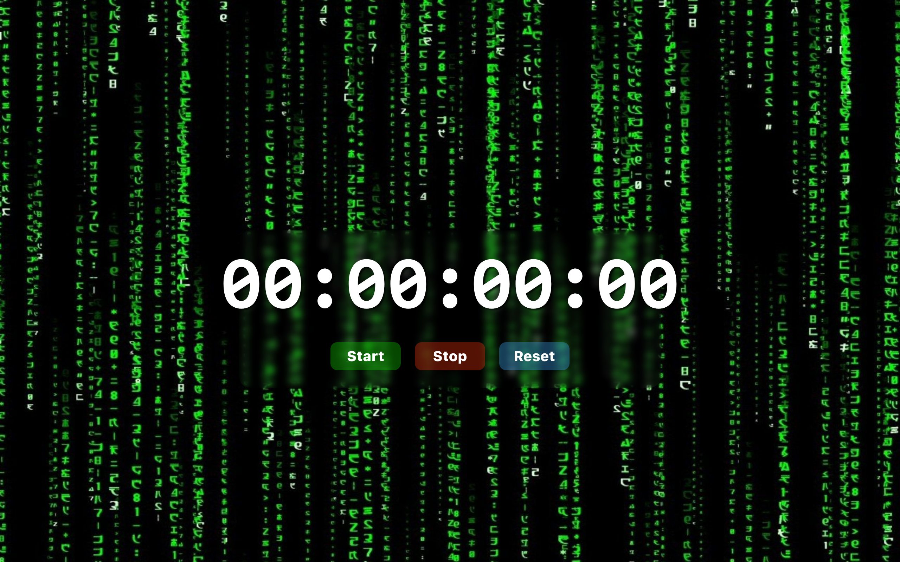
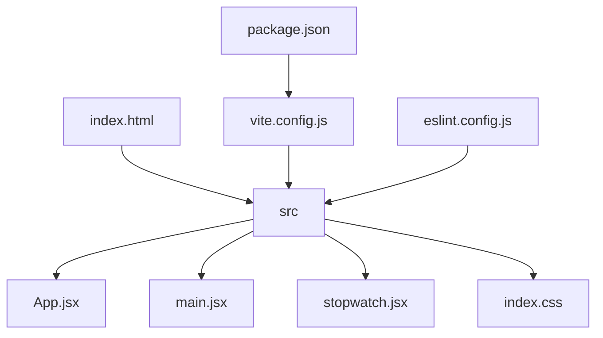
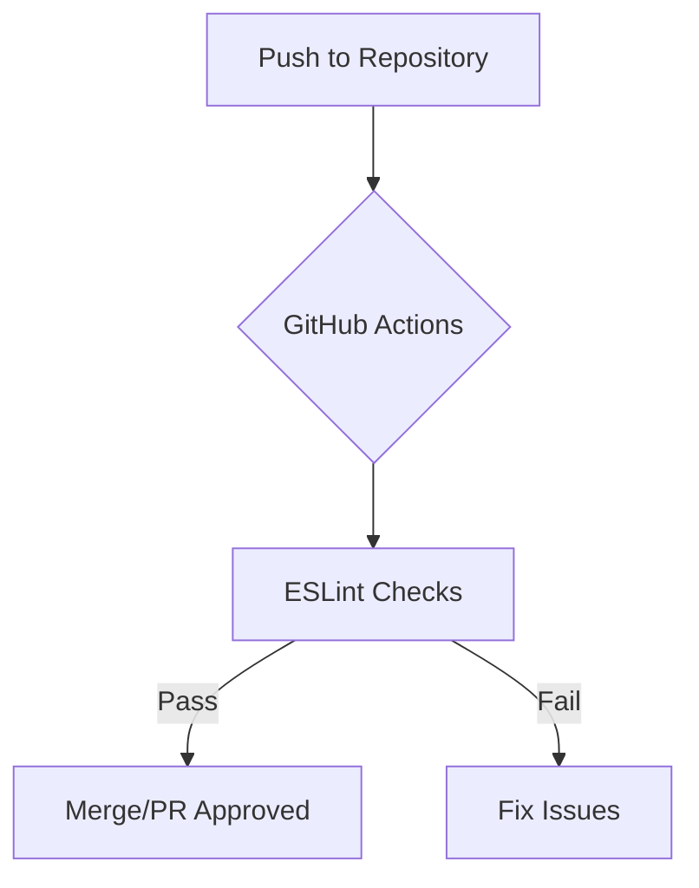

# Dev Clock 🕰️

## 🗂️ Description

Dev Clock is a simple stopwatch application built with React, designed for developers who need a quick and easy-to-use timer. This project serves as a basic implementation of a stopwatch feature, showcasing modern web development tools and best practices. It's ideal for those looking to understand React components, state management, and side effects.

The application provides a straightforward stopwatch functionality, allowing users to start, stop, and reset the timer. It's built with a focus on clean code, readability, and maintainability, making it a great learning resource for developers.

## ✨ Key Features

### Core Features
- **Stopwatch Functionality**: A basic stopwatch that can start, stop, and reset.
- **React Components**: Utilizes React functional components for building the UI.
- **State Management**: Manages state with React Hooks (`useState`, `useEffect`, `useRef`).

### Development Features
- **Vite Build Tool**: Uses Vite for modern web application build and development.
- **ESLint Configuration**: Includes ESLint configuration for code linting and best practices enforcement.

## 🗂️ Folder Structure



## 🛠️ Tech Stack


## ⚙️ Setup Instructions

To run Dev Clock locally, follow these steps:

1. **Clone the Repository**:
   ```bash
   git clone https://github.com/KnoxCodes/Dev_Clock.git
   ```
2. **Navigate to the Project Directory**:
   ```bash
   cd Dev_Clock
   ```
3. **Install Dependencies**:
   ```bash
   npm install
   ```
4. **Start the Development Server**:
   ```bash
   npm run dev
   ```
5. **Open the Application**:
   Open your web browser and navigate to `http://localhost:5173` to view the application.

## 📈 GitHub Actions

This project utilizes GitHub Actions for automated workflows. The current setup includes:

- **Linting and Code Quality Checks**: Automated ESLint checks to ensure code quality and adherence to best practices.




<br><br>
<div align="center">

<h3>Knox</h3>
<p>No information provided.</p>
</div>
<br>
<p align="right">
  <a href="https://gitfull.vercel.app">Made by GitFull</a>
</p>
    